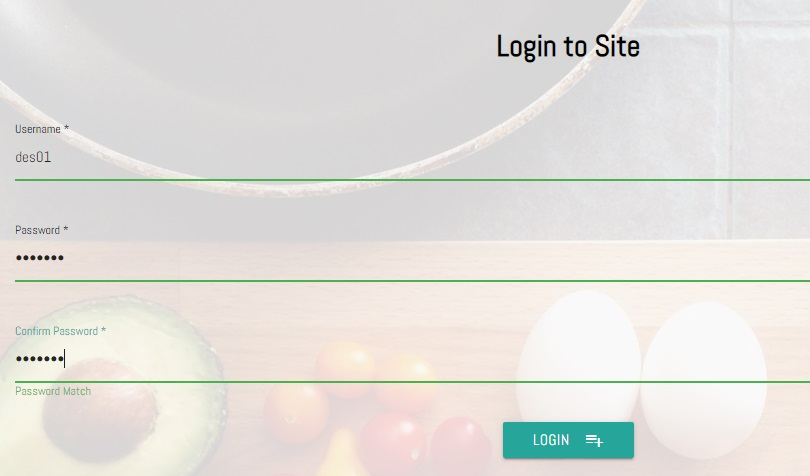
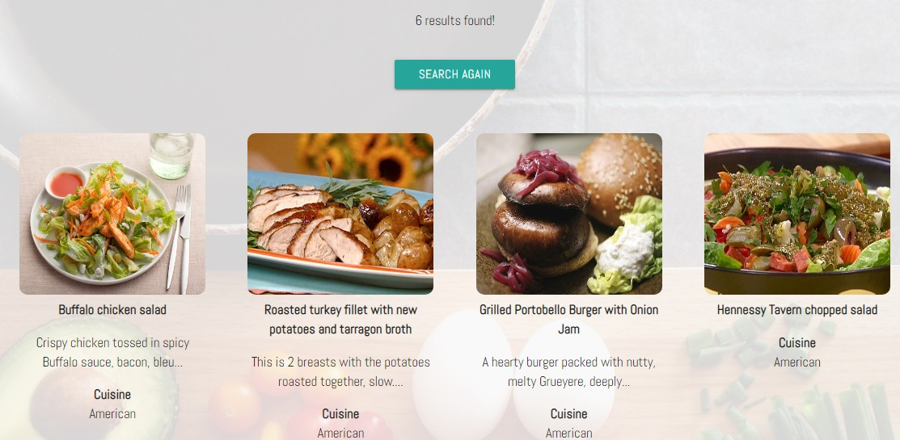
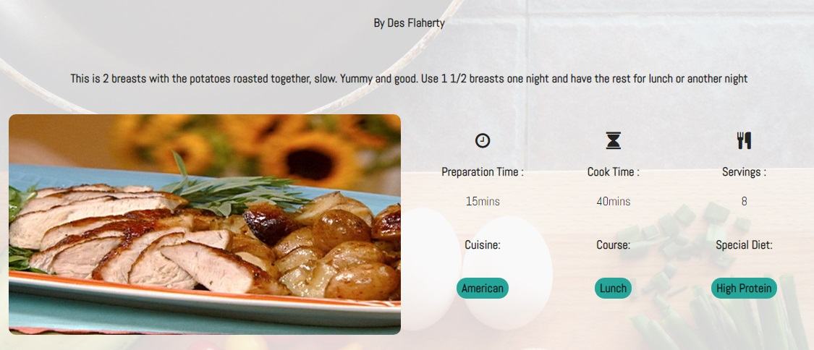
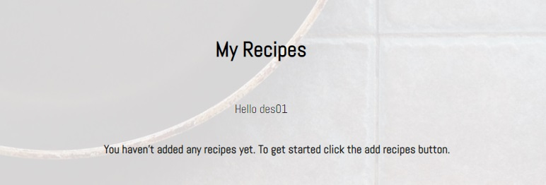
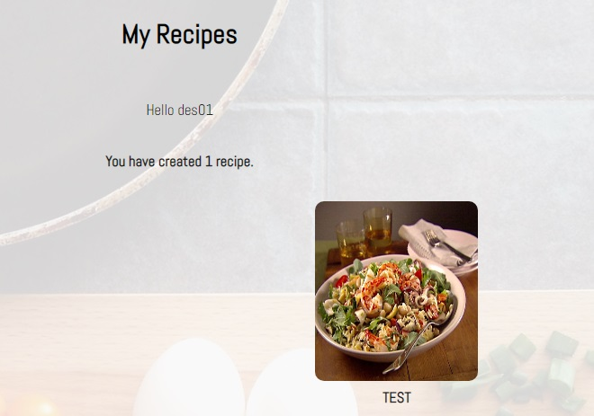
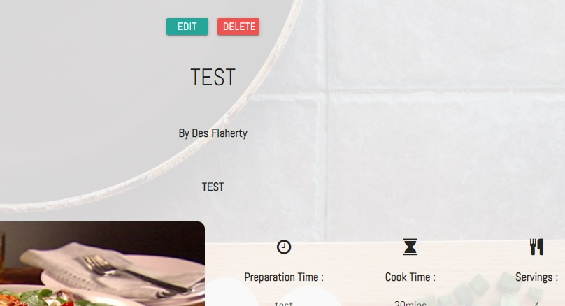
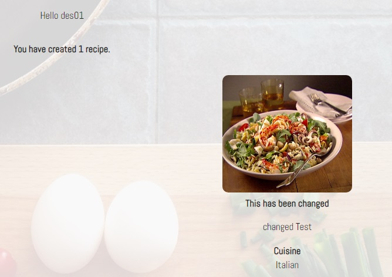

## Testing

*Index.html*
* When not logged in a message appears center of screen to inform user they can browse or register to create a recipe
* 'Enter' button brings the non logged in user to a recipe page sorted by popularity
* 'Register' button brings the user to the register page where they can register

*Base.html*
* 'The Easy CookBook' logo on the navigation menu directs to the index/home page
* The 'Home' button on the navigation menu directs to the index/home page
* The 'Recipes' button brings the non logged in user to a recipe page sorted by popularity
* The 'Register'  button brings the user to the register page where they can register
* The 'Login' button brings the user to the login page to login after registration
* Tested on mobile the menu collapses to the right of the nav bar as tiled icons and opens to the right of screen
* Tested on Galaxy 5, Iphone 5/6/7/8, iPad, iPad Pro
* When logged in a message appears that the user is logged in 'Browse Recipes' button is displayed
* Navbar changes when a user is logged in to show 'Add Recipes', 'My Recipes', 'Logout'

*Register.html*
* All fields are required and a HTML validation message is displayed if the user tries to submit the form with a blank row
* Password and confirmation password must match
* When the user registers they are re-directed to the profile page where their username is displayed

*Profile.html*
* Username is displayed center of screen with a message that you can now create a recipe
* Navbar has changed to show 'Add Recipes','My Recipes' and 'Logout' buttons
* Logout returns the user to the index page where they can login again

*Login.html*
* Passwords on the form page must match
* When username & password is entered the user is directed to the profile page

*Recipes.html*
* Recipes are displayed in a grid - large view shows 4 recipes across, mobile shows one recipe scrolling down the page
* The user can search from dropdown menus by cuisine, course or diet
* A text box search is available
* Testing each drop down menu individually returns recipes
* Recipes can be further filterd by choosing additional filter options

*My Recipes*
* If no recipes have been created by a logged in user a message will display to inform the user of this
* Once a recipe has been created it dislpays here
* There is a count of the number of recipes displayed

*Single Recipe*
* Detailed view of recipes
* Responsive on tested devices

*My Single Recipe*
* Detailed view of created recipe
* Edit and Delete buttons are available

*Add Recipe*
* Form for a user to add a recipe

*Edit My Recipe*
* When Edit is clicked the edit form opens with the required fields populated
* The fields can now be edited
* When edited the new information is written to the database
* Newly updated recipe is called from the database
* The edited recipe is displayed to the user in the my recipe page
* Tested on mobile and view is responsive

*Delete Recipe*
* When the user clicks the delete button in my single recipes page a modal confirmation is displayed
* The delete removes the recipe from the database and the user is redirected to the my recipes pages

